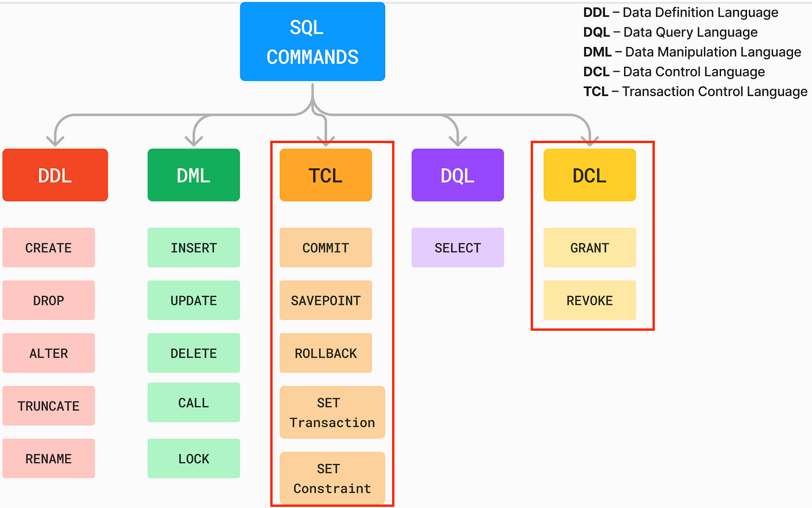

# SQL: TCL & DCL

## TCL

- TCL is a set of commands used to manage transactions in a database.
- Transaction is a single unit of work that consists of one or more operations. A PostgreSQL transaction is atomic, consistent, isolated, and durable (ACID).
  
- TCL command consists of
  - COMMIT
  - ROLLBACK
  - SAVEPOINT
  - ROLLBACK TO SAVEPOINT
  - RELEASE SAVEPOINT

## DCL

- DCL is a set of commands used to control access to the database and manage user privileges.
- DCL command consist of
  - GRANT
  - REVOKE

## References

- FTDS Colab <https://colab.research.google.com/github/FTDS-learning-materials/phase-0/blob/main/w2/P0W2D2PM%20-%20SQL_TCL%26DCL.ipynb>
- PostgreSQL Transaction <https://www.postgresqltutorial.com/postgresql-tutorial/postgresql-transaction/>
