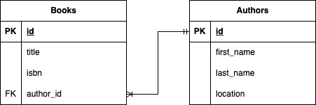

# Exercise

- Create an [SQL file](script.sql) that contains a script that does the following tasks:
  - Create **a transaction block** that consists of:
      1. Create 2 tables like this, make sure to define **Primary Key** and **Foreign Key**
            
      2. Perform INSERT the following data:

            ```text
            authors
            (id, first_name, last_name, location)
            1, John, Rowling, California
            2, Jane, Clinton, Alaska

            books
            (id, title, isbn, author_id)
            1, Prisoner of Azkaban, 67241, 1
            2, Make Alaska Great Again, 78421, 2
            3, Goblet of Fire, 21378, 1
            4, The Hash Slinging Slasher, 98231, 1
            ```

      3. Perform UPDATE and DELETE from the existing data

## Notes
>
> Consult with Buddy/Instructor to review your work.
>
> Good luck 🚀
